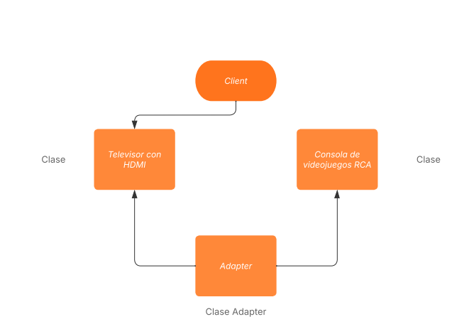
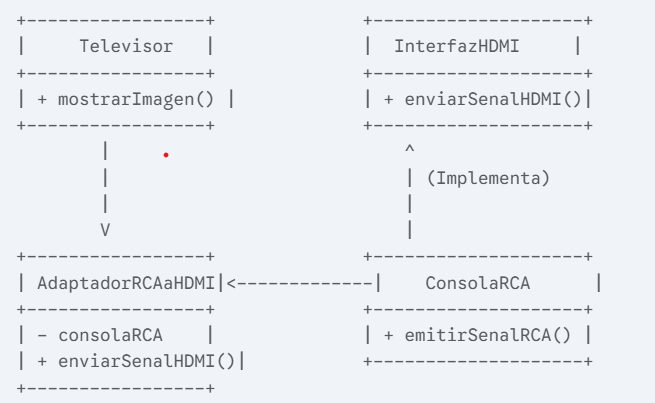

Patrón Estructural Adapter: 

Consola RCA a Televisor HDMI

¿Qué es el Patrón Adapter?
El patrón Adapter (también conocido como Wrapper o Envoltorio) es un patrón de diseño estructural que permite que objetos con interfaces incompatibles colaboren. Es como un traductor universal: convierte la interfaz de una clase en otra interfaz que el cliente espera, permitiendo que clases que de otra manera no podrían trabajar juntas lo hagan debido a interfaces incompatibles.

Imagina que tenés un televisor moderno con entrada HDMI (la "interfaz" que espera para recibir una señal de video) y una consola de videojuegos antigua con salida RCA (la "interfaz" que la consola puede producir). Obviamente, no podés conectar la consola directamente al televisor. El adaptador de RCA a HDMI que comprás para resolver este problema es el ejemplo perfecto del patrón Adapter: permite que la consola con salida RCA se conecte y funcione en el televisor HDMI.

¿Cuándo usar el Patrón Adapter?
Utilizá el patrón Adapter cuando:

Necesitás usar una clase existente (como una consola RCA) pero su interfaz (salida RCA) no coincide con la que necesitás (entrada HDMI).
Querés crear una clase reutilizable que pueda colaborar con clases no relacionadas que tienen interfaces incompatibles.
Estás trabajando con un sistema que usa un formato de datos o un tipo de objeto (Televisor HDMI), y necesitás integrar componentes que usan un formato o tipo diferente (Consola RCA).
Estructura del Patrón Adapter
El patrón Adapter involucra los siguientes componentes principales:

Cliente (Client): Es la clase que colabora con objetos que implementan la Interfaz del Objetivo. En nuestro caso, es el Televisor, que espera una señal HDMI.
Interfaz del Objetivo (Target Interface): Define la interfaz que el Cliente espera. Es el "lenguaje" que el Televisor entiende, es decir, la interfaz para recibir una señal HDMI.
Adaptado (Adaptee): Es la clase existente con la interfaz incompatible que no se puede modificar. En nuestro caso, es la Consola RCA, que solo puede emitir una señal RCA.
Adaptador (Adapter): Es la clase que implementa la Interfaz del Objetivo (la del HDMI) y contiene una instancia del Adaptado (la Consola RCA). Es el "conversor de RCA a HDMI" que traduce la señal RCA de la consola a una señal HDMI compatible con el televisor.

En el diagrama:

El Televisor interactúa con el AdaptadorRCAaHDMI a través de la InterfazHDMI.
El AdaptadorRCAaHDMI "adapta" las llamadas del Televisor (que espera HDMI) a la ConsolaRCA utilizando su método emitirSenalRCA().
Ejemplo Práctico
Vamos a modelar el escenario del televisor HDMI y la consola RCA usando el patrón Adapter.

Interfaz del Objetivo (InterfazHDMI.java)

Esta es la interfaz que nuestro televisor espera para mostrar una imagen.

public interface InterfazHDMI {
void conectarHDMI();
void enviarSenalHDMI();
}
Adaptado (ConsolaRCA.java)

Esta es nuestra consola antigua que solo puede emitir señal por RCA. No podemos cambiar su código.

public class ConsolaRCA {
public void conectarCableRCA() {
System.out.println("Consola RCA: Cable RCA conectado.");
}

    public void emitirSenalRCA() {
        System.out.println("Consola RCA: Emitiendo señal de video y audio analógico (RCA).");
    }
}

Adaptador (AdaptadorRCAaHDMI.java)

Este es nuestro "conversor" mágico. Implementa la interfaz HDMI que el televisor entiende y, por dentro, usa la consola RCA.

public class AdaptadorRCAaHDMI implements InterfazHDMI {
private ConsolaRCA consolaRCA;

    public AdaptadorRCAaHDMI(ConsolaRCA consolaRCA) {
        this.consolaRCA = consolaRCA;
        System.out.println("Adaptador: Inicializando conversor RCA a HDMI.");
    }

    @Override
    public void conectarHDMI() {
        System.out.println("Adaptador: Conectando el cable HDMI al televisor.");
        consolaRCA.conectarCableRCA(); // Internamente, el adaptador maneja la conexión RCA
    }

    @Override
    public void enviarSenalHDMI() {
        // Aquí es donde ocurre la magia de la adaptación.
        // El adaptador recibe la petición de HDMI y la traduce a RCA para la consola.
        System.out.println("Adaptador: Convirtiendo señal RCA a HDMI...");
        consolaRCA.emitirSenalRCA(); // La consola emite su señal RCA
        System.out.println("Adaptador: Señal HDMI lista para el televisor.");
    }
}

Cliente (Televisor.java)

Nuestro televisor solo sabe cómo trabajar con interfaces HDMI.

public class Televisor {
public void conectarDispositivo(InterfazHDMI dispositivo) {
System.out.println("\nTelevisor: Intentando conectar dispositivo HDMI...");
dispositivo.conectarHDMI();
dispositivo.enviarSenalHDMI();
System.out.println("Televisor: ¡Señal recibida y mostrada en pantalla!");
}

    public static void main(String[] args) {
        // --- Escenario 1: Un dispositivo HDMI nativo (Ej: un reproductor de Blu-ray) ---
        class ReproductorBluRay implements InterfazHDMI {
            @Override
            public void conectarHDMI() {
                System.out.println("Blu-Ray: Conectado vía HDMI directamente.");
            }
            @Override
            public void enviarSenalHDMI() {
                System.out.println("Blu-Ray: Enviando señal de video y audio digital (HDMI).");
            }
        }
        
        Televisor miTelevisor = new Televisor();
        InterfazHDMI reproductor = new ReproductorBluRay();
        miTelevisor.conectarDispositivo(reproductor);

        // --- Escenario 2: La Consola RCA usando el Adaptador ---
        System.out.println("\n--- Intentando conectar una Consola RCA ---");
        ConsolaRCA miConsolaAntigua = new ConsolaRCA();
        
        // No podemos hacer esto directamente: miTelevisor.conectarDispositivo(miConsolaAntigua);
        // ¡La ConsolaRCA no implementa InterfazHDMI!

        // Creamos el Adaptador para que la ConsolaRCA pueda interactuar con el Televisor
        InterfazHDMI adaptadorConsola = new AdaptadorRCAaHDMI(miConsolaAntigua);
        miTelevisor.conectarDispositivo(adaptadorConsola);
    }
