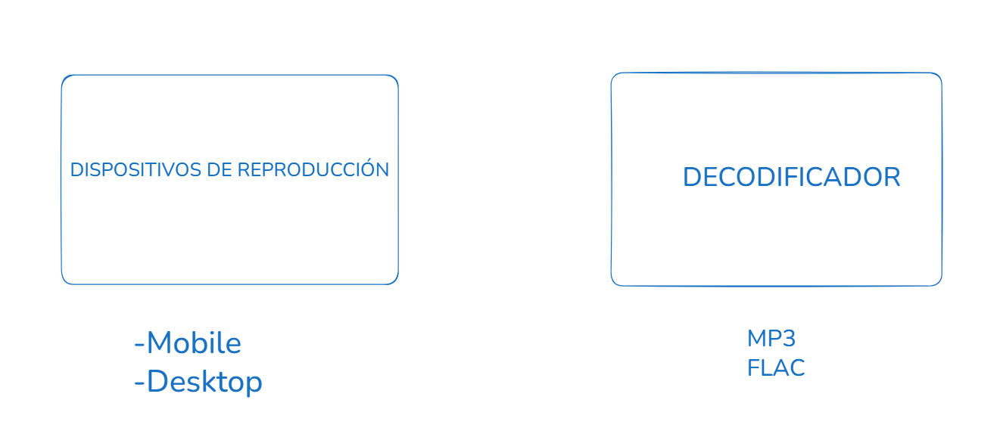
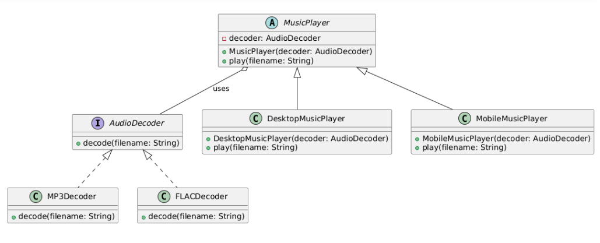

# Pattern design: Bridge

### Objetivo:
- Separar una abstracción de su implementación para que ambas puedan evolucionar independientemente.


### ¿Cuando usar?

- Cuando quieres separar la abstracción de su implementación para que ambas puedan cambiar independientemente. Osea, tenes varios objetos
y varios comportamientos y los queres combinar.

- Cuando tu sistema tiene una jerarquía de clases compleja y no quieres una explosión combinatoria de subclases.
Por ejemplo, si tienes 3 tipos de reproductores y 4 tipos de decodificadores, sin Bridge tendrías que crear 12 subclases diferentes (3x4). Con Bridge solo creas 3 clases para reproductores y 4 para decodificadores, y las combinas en tiempo de ejecución.


### Ejemplo: 




```java
// Implementor
interface AudioDecoder {
    void decode(String filename);
}

// Concrete Implementor 1
class MP3Decoder implements AudioDecoder {
    public void decode(String filename) {
        System.out.println("Decodificando archivo MP3: " + filename);
    }
}

// Concrete Implementor 2
class FLACDecoder implements AudioDecoder {
    public void decode(String filename) {
        System.out.println("Decodificando archivo FLAC: " + filename);
    }
}

// Abstraction
abstract class MusicPlayer {
    protected AudioDecoder decoder;

    public MusicPlayer(AudioDecoder decoder) {
        this.decoder = decoder;
    }

    public abstract void play(String filename);
}

// Refined Abstraction 1
class DesktopMusicPlayer extends MusicPlayer {
    public DesktopMusicPlayer(AudioDecoder decoder) {
        super(decoder);
    }

    public void play(String filename) {
        System.out.println("Reproduciendo en reproductor de escritorio...");
        decoder.decode(filename);
    }
}

// Refined Abstraction 2
class MobileMusicPlayer extends MusicPlayer {
    public MobileMusicPlayer(AudioDecoder decoder) {
        super(decoder);
    }

    public void play(String filename) {
        System.out.println("Reproduciendo en reproductor móvil...");
        decoder.decode(filename);
    }
}

public class Main {
    public static void main(String[] args) {
        // Crear decodificadores concretos
        AudioDecoder mp3Decoder = new MP3Decoder();
        AudioDecoder flacDecoder = new FLACDecoder();

        // Crear reproductores con diferentes decodificadores
        MusicPlayer desktopPlayerMP3 = new DesktopMusicPlayer(mp3Decoder);
        MusicPlayer mobilePlayerFLAC = new MobileMusicPlayer(flacDecoder);

        // Usar los reproductores para reproducir archivos
        desktopPlayerMP3.play("cancion1.mp3");
        mobilePlayerFLAC.play("cancion2.flac");
    }
}

```
