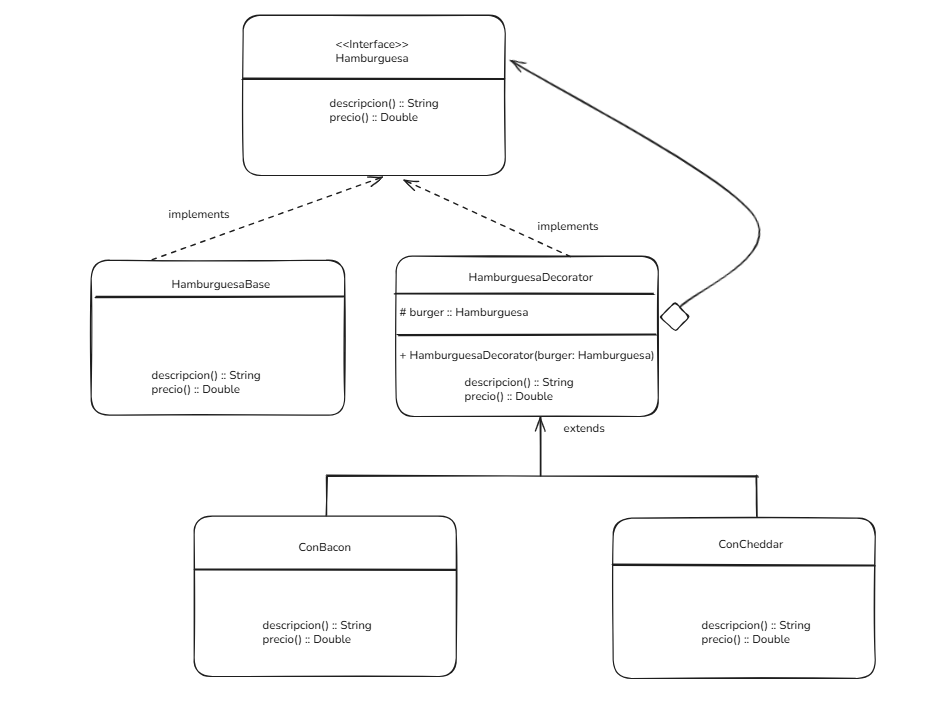

### Decorator 

- Permite añadir comportamiento a objetos individuales de forma dinámica, sin afectar el comportamiento de otros objetos de la misma clase.

### Crea un conjunto de clases DECORADORAS, que se utilizan para encapsular componentes concretos.

## Usos: 

- Extension de funcionalidad: Añade comportamientos sin modificar estructura.

- Combinaciones múltiples de características: Estas se combinan creando variaciones personalizadas de los objetos.

- Integración de código heredado: Ampliar la funcionalidad de objetos existentes sin alterar su implementación base.

- Componentes de la GUI: en el desarrollo de las interfaces gráficas del usuario (GUI), los decoradores se pueden usar para gregar efectos visuales adicionales, como bordes, sombras o animaciones, o en GUI, botones paneles o ventanas.

- Flujo de entrada/salida: .Los decoradores se utilizan para encapsular clases de streams i/o en Java. Permiten encapsular streams con func adicionales, como alm en bufer, compresión, cifrado o registro, sin modificar las clases de flujo originales.


## Componentes clave de Decorator:

- Interfaz de componente: Es una clase abstracta, que define la interfaz común para los componentes concretos y los decoradores.
Especifica las operaciones que se pueden realizar en los objetos.

- Componente Concreto: Son los objetos a los que queremos añadir nuevos comportamientos o responsabilidades.

- Decorador: Clase abstracta que también implementa la interfaz component y tiene una referencia a un objeto Component. Responsable de añadir nuevos comportamientos al objeto Component encapsulado.

- Decorador concreto: Clases concretas que extienden la clase Decorador. Añaden comportamientos o responsabilidades específicas al componente. Cada decorador concreto puede añadir uno o más comportamientos al componente.

> Supongamos que estamos desarrollando una aplicación para una cafetería donde los clientes pueden pedir diferentes tipos de café. Cada café puede tener varios complementos opcionales, como leche, azúcar, crema batida, etc. Queremos implementar un sistema que permita añadir dinámicamente estos complementos a un pedido de café sin modificar las clases de café.´´

#### Componente de interfaz:

```java
// Coffee.java
public interface Coffee {
    String getDescription();
    double getCost();
}
```


#### Componente concreto: 
- Proporciona la descripcion y costo implementando la interfaz Coffee y haciendo un override
```java
// PlainCoffee.java
public class PlainCoffee implements Coffee {
    @Override
    public String getDescription() {
        return "Plain Coffee";
    }

    @Override
    public double getCost() {
        return 2.0;
    }
}
```

#### Decorator de cafe: 

- Clase abstracta que implementa la interfaz Coffee
- Mantiene una referencia al objeto Coffee
- Los metodos se implementan para delegar el decorate coffee object.

```java
//// CoffeeDecorator.java
public abstract class CoffeeDecorator implements Coffee {
    protected Coffee decoratedCoffee;

    public CoffeeDecorator(Coffee decoratedCoffee) {
        this.decoratedCoffee = decoratedCoffee;
    }

    @Override
    public String getDescription() {
        return decoratedCoffee.getDescription();
    }

    @Override
    public double getCost() {
        return decoratedCoffee.getCost();
    }
}
```


#### Ejemplo: decorator Milk, y Sugar

```java
// MilkDecorator.java
public class MilkDecorator extends CoffeeDecorator {
    public MilkDecorator(Coffee decoratedCoffee) {
        super(decoratedCoffee);
    }

    @Override
    public String getDescription() {
        return decoratedCoffee.getDescription() + ", Milk";
    }

    @Override
    public double getCost() {
        return decoratedCoffee.getCost() + 0.5;
    }
}

// SugarDecorator.java
public class SugarDecorator extends CoffeeDecorator {
    public SugarDecorator(Coffee decoratedCoffee) {
        super(decoratedCoffee);
    }

    @Override
    public String getDescription() {
        return decoratedCoffee.getDescription() + ", Sugar";
    }

    @Override
    public double getCost() {
        return decoratedCoffee.getCost() + 0.2;
    }
}

```


 ### Otro ejemplo: 

  Decorator es un patron de diseño, que deberiamos detectar a partir de encontrar lógica repetida en la estructura de un programa,
  Es decir, por ejemplo, una hamburguesa, si nostoros tenemos una hamburguesa, sabemos que el concepto basico es pan + carne + pan, pero despues podemos tener una hamburguesa simple con queso, una hamburguesa doble, una hamburguesa completa, etc...
  nosotros para evitar alterar nuestra hamburguesa estandar, y apoyar la modularidad, podemos envolver a la hamburguesa simple en decoraciones, al final, siempre es la misma hamburguesa, a la cual se le esta agregando cosas.


### UML:



### Código
```java
// Componente base
interface Hamburguesa {
    String descripcion();
    double precio();
}

// Hamburguesa básica
class HamburguesaBase implements Hamburguesa {
  
    @Override   
    public String descripcion() {
      return "Pan + Carne + Pan";
    }

    @Override
    public double precio() {
        return 5.0;
    }
}

// Decorador abstracto
abstract class HamburguesaDecorador implements Hamburguesa {
    protected Hamburguesa burger;

    public HamburguesaDecorador(Hamburguesa bur) {
        this.burger = bur;
    }
}

// Decoradores concretos
class ConQueso extends HamburguesaDecorador {
    public ConQueso(Hamburguesa burger) {
        super(burger);
    }
 @Override
    public String descripcion() {
        return burger.descripcion() + " + Queso";
    }
 @Override
    public double precio() {
        return burger.precio() + 1.5;
    }
}

class ConBacon extends HamburguesaDecorador {
    public ConBacon(Hamburguesa burger) {
        super(burger);
    }
 @Override
    public String descripcion() {
        return burger.descripcion() + " + Bacon";
    }
 @Override
    public double precio() {
        return burger.precio() + 2.0;
    }
}
```

 