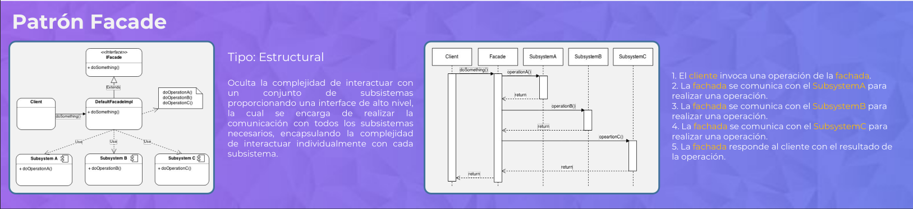
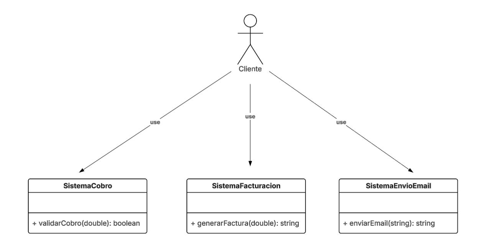
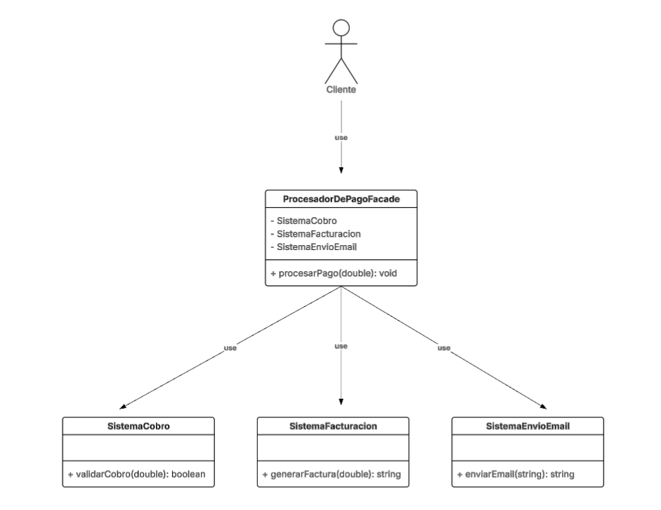
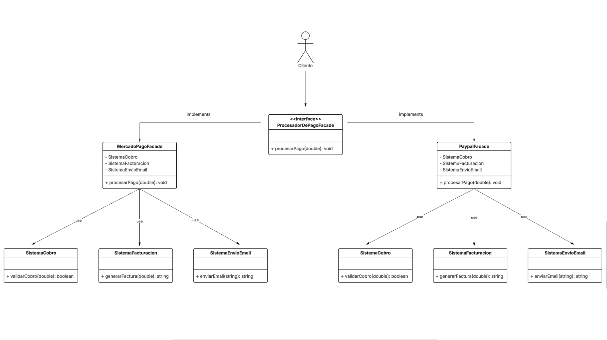

# Patrón de diseño FACADE

### Este patrón pertenece a la familia de los estructurales.

El patrón Facade permite la creación de “fachadas” que ocultan la complejidad de interactuar con un
conjunto de subsistemas, mediante la implementación de interfaces de alto nivel que se encargan de 
realizar la comunicación con todos los subsistemas.

# Escenario:

### En el siguiente ejemplo vamos a simular un procesador de pagos en linea de forma simplificada.

A continuación, nos encontramos con un escenario donde debemos interactuar con tres subsistemas para
efectuar el pago de un servicio.

Como se puede apreciar en la imagen anterior, no solo debemos conocer en detalle la implementación de
cada subsistema, sino que también debemos conocer su orden de ejecución, ya que, en este caso, no se
podría enviar el email al usuario sin antes haber efectuado el cobro y generado la factura.

Dejarle toda esa responsabilidad al cliente puede tener varios inconvenientes, dado que puede ejecutar
los subsistemas en un orden incorrecto o incluso no tener el conocimiento técnico para entenderlos.

# Solución:

Vamos a implementar el patrón Facade para simplificar la comunicación con los tres subsistemas mediante
una clase que los envuelva y llame internamente a cada uno.

Con la creación de la clase ProcesadorDePagoFacade queda completamente oculta la implementación de cada
subsistema, y mediante el método procesarPago() se simplifican todas las llamadas a sus métodos internos.

Esto funciona de la siguiente manera:

La clase ProcesadorDePagoFacade tiene a los tres subsistemas como atributos de clase, y mediante el 
método procesarPago() utiliza uno a uno los métodos de cada subsistema en el orden correcto:

- Primero llama al método validarCobro(), pasándole el monto a cobrar.

- Una vez cobrado, llama al método generarFactura(), pasándole el mismo monto ya cobrado.

- Por último, llama al método enviarEmail(), pasándole la factura emitida.

# Extensibilidad:

Opcionalmente, este patrón puede tener una interfaz que defina la estructura básica de todas las
fachadas, para así poder tener varias implementaciones diferentes.

En el ejemplo anterior, nuestro sistema está completamente acoplado a un sistema de pago como podría
ser MercadoPago.

Creando una interfaz que defina el método para procesar el pago, lo que estamos ganando es 
compatibilidad entre las diferentes implementaciones y también una flexibilidad futura al momento
de elegir una implementación u otra.

De esta manera, no solo resolvimos la problemática de tener que interactuar con los tres subsistemas
manualmente, sino que también dejamos un sistema que puede crear nuevos métodos de pago (fachadas) de
una manera rápida, sin la necesidad de tocar el código existente. Incluso, como ahora todas las
implementaciones son compatibles, podríamos implementar un patrón como Factory, para que mediante
algún tipo de parámetro se cree una instancia concreta en tiempo de ejecución.